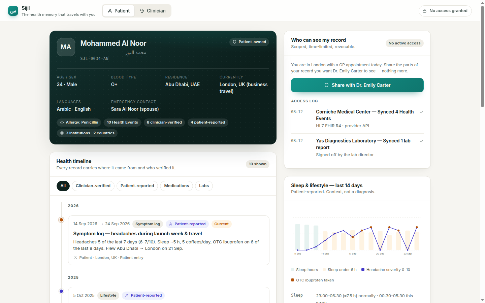
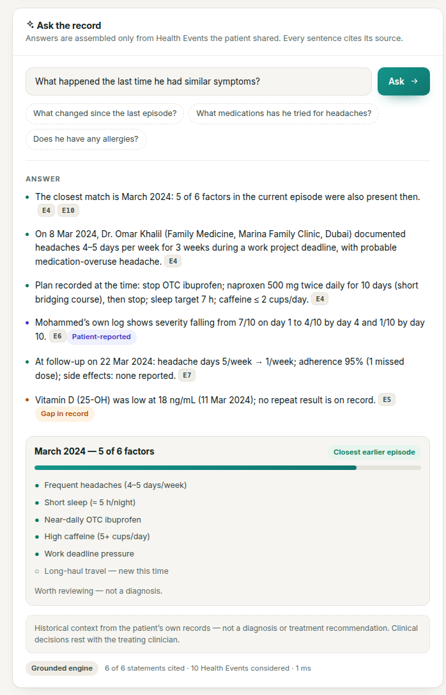
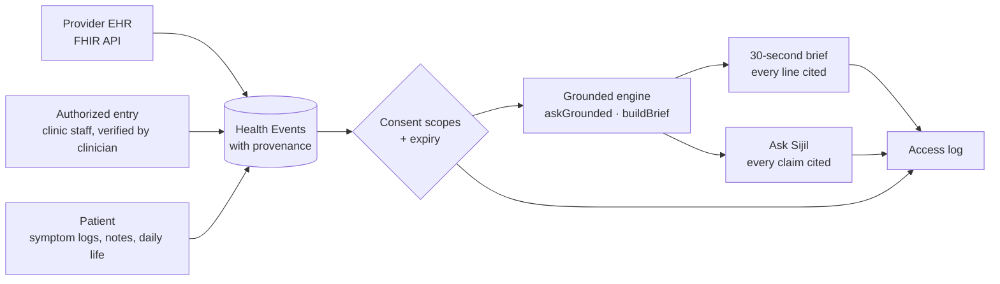
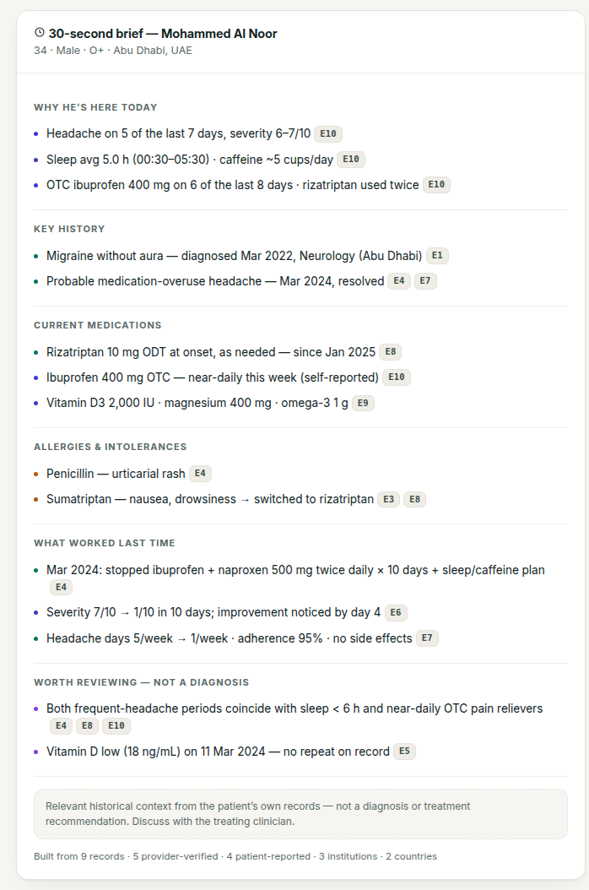
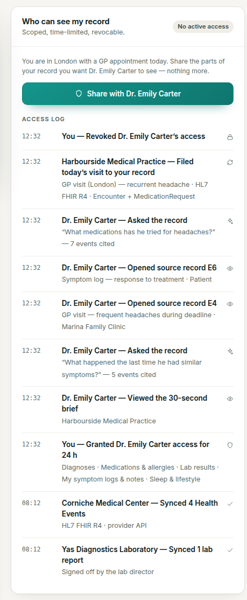

# Sijil — the health memory that travels with you

**Sijil** (سجل, Arabic for "record") is a patient-owned health memory: one longitudinal timeline of Health Events with provenance on every record, that a patient can share with any clinician, anywhere, for a limited time — and every answer Sijil gives cites the record it came from.

**Live demo:** https://mk1996ae.github.io/sijil/
**Demo video:** VIDEO_LINK_HERE



## Problem

- Health records are locked inside institutions. A patient who moves, travels or changes hospital walks into the next consultation as a blank page.
- Clinicians have minutes, not hours. Nobody has time to read a decade of records, so history is re-taken from memory — incomplete and unverified.
- "AI health assistants" answer confidently without sources, and drift into diagnosing and prescribing. That is unsafe and unauditable.

## What Sijil does

- **Timeline with provenance** — every visit, diagnosis, prescription, lab, symptom log and note is a Health Event. Each carries where it came from (institution, country), how it arrived (hospital API, authorized entry, patient), and who verified it. Clinician records are locked; the patient can annotate, never edit.
- **Ask Sijil, with citations** — a clinician asks a question in plain language; Sijil answers from the shared records and every sentence carries a clickable citation to its Health Event. If the record does not contain it, Sijil says so.
- **30-second doctor brief** — an auto-generated summary of what matters (active problems, medications, allergies, recent labs, patterns worth reviewing), every line cited.
- **Patient-controlled consent + access log** — scoped (labs, mental health, lifestyle…) and time-limited (1/24/72 h) grants, revocable instantly; the patient sees who viewed what, asked what and opened which record, at what time.
- **Daily-life context** — patient-reported sleep, caffeine, exercise, work/travel and a 14-day log, labelled as patient-reported and never confused with clinician data.

## Demo story

Mohammed Al Noor, 34, lives in Abu Dhabi. He is in London on a work launch week with headaches on 5 of the last 7 days. He grants Dr. Emily Carter, a London GP, 24-hour scoped access (mental health withheld). She reads the 30-second brief and asks *"What happened the last time he had similar symptoms?"* Sijil finds the **March 2024** episode — **5 of 6 matching factors** (only long-haul travel differs) — what was done, how he responded, and a possible medication-overuse component a clinician documented at the time, every claim cited to its source. She files today's visit, and it syncs back into Mohammed's timeline as a Harbourside Medical Practice record, provider-verified.



## Architecture



Everything runs client-side in this demo: Vite + React + TypeScript, plain CSS with design tokens, no router, no backend, no database. Deployed to GitHub Pages by GitHub Actions.

## Data model

| `HealthEvent` field | Meaning |
|---|---|
| `id`, `date`, `type` | `E4`, `2024-03-08`, one of visit · diagnosis · prescription · medication_change · lab · symptom_log · patient_note · treatment_outcome · lifestyle |
| `title`, `summary` | Human-readable headline and one-paragraph summary |
| `diagnosis`, `medications`, `allergies`, `labs` | Structured clinical content (ICD label/code, dose/frequency, substance/reaction, value/unit/reference range) |
| `series`, `factors`, `tags` | Symptom-severity series, episode factors used for matching, e.g. `current` |
| `patientAnnotations` | Patient notes attached to a locked clinician record |
| `provenance` | See below |

| `Provenance` field | Meaning |
|---|---|
| `institution`, `city`, `country` | Where the record originates |
| `channel` | `provider_api` · `authorized_entry` · `patient` |
| `enteredBy`, `recordedAt` | Who/what entered it and when it reached Sijil |
| `verification`, `verifiedBy` | `provider_verified` (with the verifying clinician) or `patient_reported` |
| `sourceRef`, `standard` | Original record id at the provider, e.g. `HL7 FHIR R4 · Encounter` |

## Safety

- Sijil does **not** diagnose, prescribe, or tell anyone to start, stop or change a medication.
- Every claim in a brief or an answer cites a Health Event — or Sijil states that the shared records do not contain it.
- Patient-reported data is always labelled and visually distinct (indigo) from provider-verified data (green).
- Clinician records are immutable in the patient's hands: annotate, not edit.
- The smoke test (`npm run smoke`) fails the build if any claim is uncited, cites a non-existent event, or contains prescribing language.




## Run locally

```bash
npm i && npm run dev
```

Tests: `npm run smoke` · Lint: `npm run lint` · Build: `npm run build`

## Roadmap

- Real FHIR R4 ingestion from provider EHRs.
- Authorized-entry portal for clinics without an API, with clinician sign-off.
- LLM mode with a citation guard — `api/ask.js` is included; answers are rejected unless every sentence resolves to a Health Event.
- Arabic-first UI.
- Cross-border Health Passport (UAE ↔ UK ↔ EU).
- Consented research layer: patients opt in to share de-identified events.

---

Built at Fish Tank by Devin × Hub71, Abu Dhabi — built with Devin. All data is synthetic; fictional patient.
